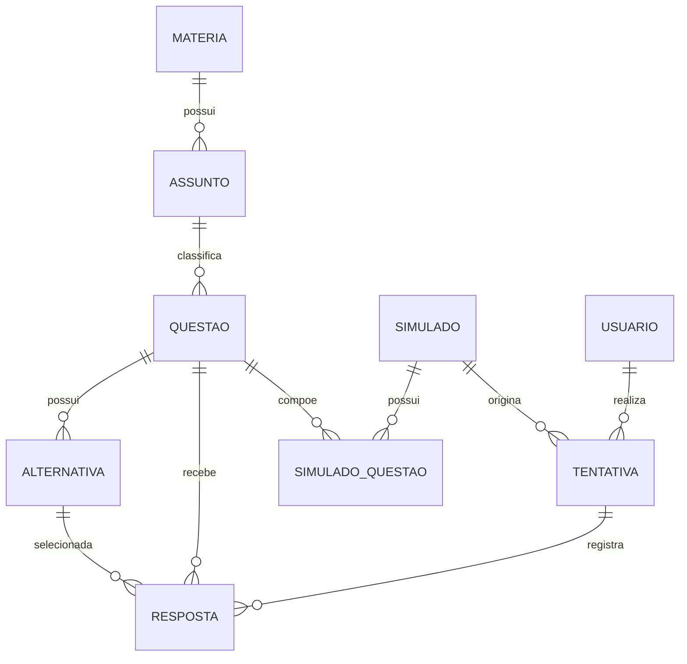

# DER — SimulaAI

**Equipe:** Gabriel Reis de Souza (2840482421005) — Davi Sousa Cirilo (2840482421006) — Vinicius Brasileiro Veras (2840482421021) — Cesar Augusto Saraiva Fifolato (2840482421022)

## 1. Diagrama

## 2. Dicionário de dados

### Tabela: usuario

| Campo      | Tipo         | Restrições       | Descrição                           |
| ---------- | ------------ | ---------------- | ----------------------------------- |
| id         | SERIAL       | PK               | Identificador do usuário            |
| email      | VARCHAR(160) | NOT NULL, UNIQUE | E-mail utilizado na autenticação    |
| senha_hash | VARCHAR(255) | NOT NULL         | Senha armazenada de forma protegida |
| perfil     | VARCHAR(20)  | NOT NULL, CHECK  | Perfil aluno ou administrador       |

---

### Tabela: materia

| Campo | Tipo         | Restrições       | Descrição                |
| ----- | ------------ | ---------------- | ------------------------ |
| id    | SERIAL       | PK               | Identificador da matéria |
| nome  | VARCHAR(100) | NOT NULL, UNIQUE | Nome da matéria          |

---

### Tabela: assunto

| Campo      | Tipo         | Restrições                | Descrição                         |
| ---------- | ------------ | ------------------------- | --------------------------------- |
| id         | SERIAL       | PK                        | Identificador do assunto          |
| materia_id | INT          | FK → materia.id, NOT NULL | Matéria à qual o assunto pertence |
| nome       | VARCHAR(120) | NOT NULL                  | Nome do assunto                   |

---

### Tabela: questao

| Campo      | Tipo   | Restrições                | Descrição                |
| ---------- | ------ | ------------------------- | ------------------------ |
| id         | SERIAL | PK                        | Identificador da questão |
| assunto_id | INT    | FK → assunto.id, NOT NULL | Assunto da questão       |
| enunciado  | TEXT   | NOT NULL                  | Enunciado da questão     |

---

### Tabela: alternativa

| Campo      | Tipo    | Restrições                | Descrição                         |
| ---------- | ------- | ------------------------- | --------------------------------- |
| id         | SERIAL  | PK                        | Identificador da alternativa      |
| questao_id | INT     | FK → questao.id, NOT NULL | Questão à qual pertence           |
| texto      | TEXT    | NOT NULL                  | Conteúdo da alternativa           |
| correta    | BOOLEAN | NOT NULL, DEFAULT FALSE   | Indica se é a alternativa correta |

---

### Tabela: simulado

| Campo     | Tipo         | Restrições              | Descrição                                    |
| --------- | ------------ | ----------------------- | -------------------------------------------- |
| id        | SERIAL       | PK                      | Identificador do simulado                    |
| titulo    | VARCHAR(150) | NOT NULL                | Título utilizado para identificar o simulado |
| criado_em | TIMESTAMP    | NOT NULL, DEFAULT now() | Data de criação do simulado                  |

---

### Tabela: simulado_questao

Tabela associativa responsável pelo relacionamento N:N entre `simulado` e `questao`.

| Campo       | Tipo | Restrições           | Descrição                    |
| ----------- | ---- | -------------------- | ---------------------------- |
| simulado_id | INT  | PK, FK → simulado.id | Simulado                     |
| questao_id  | INT  | PK, FK → questao.id  | Questão                      |
| ordem       | INT  | NOT NULL, CHECK > 0  | Ordem da questão no simulado |

---

### Tabela: tentativa

| Campo         | Tipo      | Restrições                 | Descrição                      |
| ------------- | --------- | -------------------------- | ------------------------------ |
| id            | SERIAL    | PK                         | Identificador da tentativa     |
| usuario_id    | INT       | FK → usuario.id, NOT NULL  | Aluno que realizou a tentativa |
| simulado_id   | INT       | FK → simulado.id, NOT NULL | Simulado realizado             |
| iniciada_em   | TIMESTAMP | NOT NULL, DEFAULT now()    | Início da tentativa            |
| finalizada_em | TIMESTAMP | NULL                       | Momento de finalização         |

---

### Tabela: resposta

| Campo          | Tipo      | Restrições                    | Descrição                                  |
| -------------- | --------- | ----------------------------- | ------------------------------------------ |
| id             | SERIAL    | PK                            | Identificador da resposta                  |
| tentativa_id   | INT       | FK → tentativa.id, NOT NULL   | Tentativa correspondente                   |
| questao_id     | INT       | FK → questao.id, NOT NULL     | Questão respondida                         |
| alternativa_id | INT       | FK → alternativa.id, NOT NULL | Alternativa escolhida                      |
| respondida_em  | TIMESTAMP | NOT NULL, DEFAULT now()       | Momento da resposta                        |
| explicacao_ia  | TEXT      | NULL                          | Explicação gerada pela IA quando aplicável |

