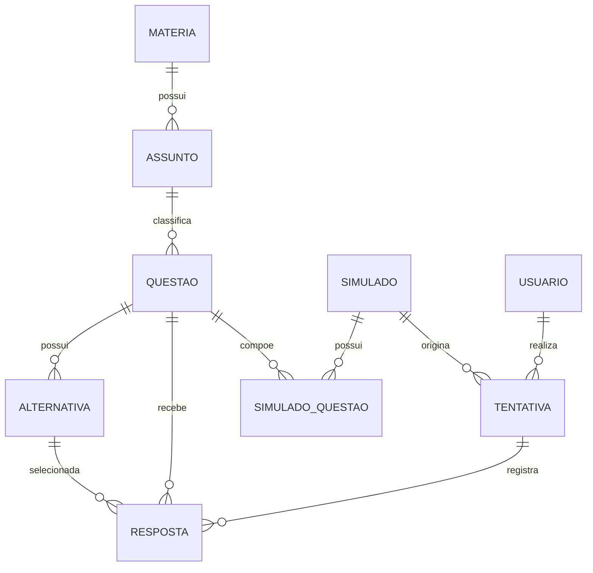

# DER — SimulaAI

**Equipe:** Gabriel Reis de Souza (2840482421005) — Davi Sousa Cirilo (2840482421006) — Vinicius Brasileiro Veras (2840482421021) — Cesar Augusto Saraiva Fifolato (2840482421022)

## 1. Diagrama

## 2. Dicionário de dados

O `schema.sql` é a fonte de verdade do modelo físico. As tabelas abaixo refletem seus nomes, tipos, defaults e restrições.

### Tabela: usuario

| Campo | Tipo | Restrições | Descrição |
|---|---|---|---|
| id | SERIAL | PK | Identificador do usuário |
| nome | VARCHAR(150) | NOT NULL | Nome completo do usuário |
| email | VARCHAR(150) | NOT NULL, UNIQUE | E-mail utilizado na autenticação |
| senha_hash | VARCHAR(255) | NOT NULL | Hash da senha armazenado pelo sistema |
| perfil | VARCHAR(50) | NOT NULL, CHECK | Perfil `ALUNO` ou `ADMINISTRADOR` |
| criado_em | TIMESTAMP | DEFAULT CURRENT_TIMESTAMP | Data de criação do usuário |

### Tabela: materia

| Campo | Tipo | Restrições | Descrição |
|---|---|---|---|
| id | SERIAL | PK | Identificador da matéria |
| nome | VARCHAR(100) | NOT NULL, UNIQUE | Nome da matéria |
| descricao | TEXT | NULL | Descrição da matéria |

### Tabela: assunto

| Campo | Tipo | Restrições | Descrição |
|---|---|---|---|
| id | SERIAL | PK | Identificador do assunto |
| materia_id | INT | NOT NULL, FK -> materia.id | Matéria à qual o assunto pertence |
| nome | VARCHAR(100) | NOT NULL | Nome do assunto |
| descricao | TEXT | NULL | Descrição do assunto |

### Tabela: questao

| Campo | Tipo | Restrições | Descrição |
|---|---|---|---|
| id | SERIAL | PK | Identificador da questão |
| assunto_id | INT | NOT NULL, FK -> assunto.id | Assunto da questão |
| enunciado | TEXT | NOT NULL | Enunciado da questão |
| nivel_dificuldade | VARCHAR(30) | NULL | Nível de dificuldade da questão |

### Tabela: alternativa

| Campo | Tipo | Restrições | Descrição |
|---|---|---|---|
| id | SERIAL | PK | Identificador da alternativa |
| questao_id | INT | NOT NULL, FK -> questao.id | Questão à qual pertence |
| texto | TEXT | NOT NULL | Conteúdo da alternativa |
| correta | BOOLEAN | NOT NULL, DEFAULT FALSE | Indica se a alternativa é correta |

### Tabela: simulado

| Campo | Tipo | Restrições | Descrição |
|---|---|---|---|
| id | SERIAL | PK | Identificador do simulado |
| titulo | VARCHAR(150) | NOT NULL | Título do simulado |
| descricao | TEXT | NULL | Descrição do simulado |
| criado_em | TIMESTAMP | DEFAULT CURRENT_TIMESTAMP | Data de criação do simulado |

### Tabela: simulado_questao

Tabela associativa responsável pelo relacionamento N:N entre `simulado` e `questao`.

| Campo | Tipo | Restrições | Descrição |
|---|---|---|---|
| simulado_id | INT | PK, NOT NULL, FK -> simulado.id | Simulado associado |
| questao_id | INT | PK, NOT NULL, FK -> questao.id | Questão associada |
| ordem | INT | NOT NULL, CHECK (ordem > 0) | Ordem da questão no simulado |

### Tabela: tentativa

| Campo | Tipo | Restrições | Descrição |
|---|---|---|---|
| id | SERIAL | PK | Identificador da tentativa |
| usuario_id | INT | NOT NULL, FK -> usuario.id | Usuário que realizou a tentativa |
| simulado_id | INT | NOT NULL, FK -> simulado.id | Simulado realizado |
| data_inicio | TIMESTAMP | DEFAULT CURRENT_TIMESTAMP | Início da tentativa |
| data_fim | TIMESTAMP | NULL | Momento de finalização |
| acertos | INT | DEFAULT 0 | Quantidade de respostas corretas |
| erros | INT | DEFAULT 0 | Quantidade de respostas incorretas |
| percentual_aproveitamento | NUMERIC(5,2) | DEFAULT 0.00 | Percentual de aproveitamento |
| status | VARCHAR(30) | DEFAULT `EM_ANDAMENTO`, CHECK | Situação da tentativa: `EM_ANDAMENTO` ou `FINALIZADO` |

### Tabela: resposta

| Campo | Tipo | Restrições | Descrição |
|---|---|---|---|
| id | SERIAL | PK | Identificador da resposta |
| tentativa_id | INT | NOT NULL, FK -> tentativa.id | Tentativa correspondente |
| questao_id | INT | NOT NULL, FK -> questao.id | Questão respondida |
| alternativa_id | INT | NOT NULL, FK -> alternativa.id | Alternativa escolhida |
| correta | BOOLEAN | NOT NULL | Indica se a resposta escolhida está correta |
| explicacao_ia | TEXT | NULL | Explicação gerada pela IA quando aplicável |
