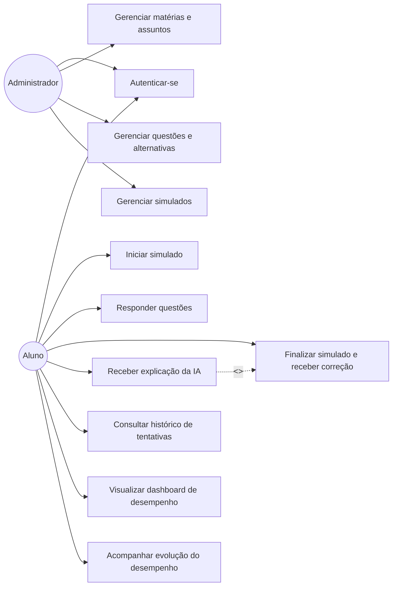
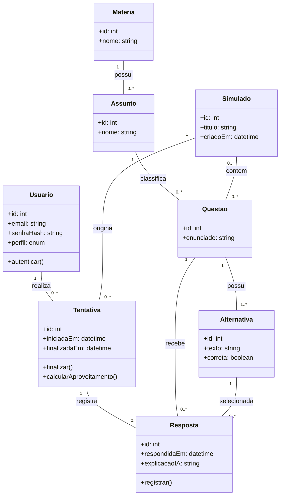

# Diagramas UML — SimulaAI

**Equipe:** Gabriel Reis de Souza (2840482421005) — Davi Sousa Cirilo (2840482421006) — Vinicius Brasileiro Veras (2840482421021) — Cesar Augusto Saraiva Fifolato (2840482421022)

## 1. Diagrama de Casos de Uso

## 2. Diagrama de Classes

## 3. Rastreabilidade — caso de uso → história do backlog

| Caso de uso                           | História(s) relacionada(s) (E2) |
| ------------------------------------- | ------------------------------- |
| Autenticar-se                         | #1                              |
| Gerenciar matérias e assuntos         | #2                              |
| Gerenciar questões e alternativas     | #3                              |
| Iniciar simulado                      | #4                              |
| Responder questões                    | #5                              |
| Finalizar simulado e receber correção | #6                              |
| Receber explicação da IA              | #7                              |
| Consultar histórico de tentativas     | #8                              |
| Visualizar dashboard de desempenho    | #9                              |
| Acompanhar evolução do desempenho     | #10                             |
| Gerenciar simulados                   | #11*                            |
